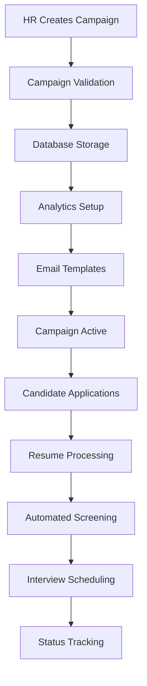

<!-- _backgroundColor: #1a237e -->
# TalentPivot: Transforming HR Campaigns


**Empowering HR with Data & Agility**
<!-- _backgroundColor: #1a237e -->
# TalentPivot: Transforming HR Campaigns


**Empowering HR with Data & Agility**

---

<!-- _backgroundColor: #e53935 -->
## The Challenge
**The HR Bottleneck**
Why traditional HR campaigns struggle

- Manual steps
- Slow processes
- Limited insights


> **Infographic Placeholder:** Pie chart showing % of time wasted in manual processes

---

<!-- _backgroundColor: #43a047 -->
## Our Solution
**TalentPivot Platform**
From manual to magical

- Automated campaign management
- Real-time analytics


> **Infographic Placeholder:** Before/after bar chart (time, cost, accuracy)

---

<!-- _backgroundColor: #fbc02d -->
## Architecture at a Glance
**Smart, Scalable, Secure**

- Frontend: React + TypeScript + Vite
- Backend: Node.js + Express + TypeScript
- Cloud: Google Cloud, Docker, Nginx
- CI/CD: Jenkins


> **Infographic Placeholder:** Layered architecture diagram with animated arrows

---

<!-- _backgroundColor: #2e7d32 -->
## System Architecture & Workflow Patterns
**Enterprise-Grade Design Patterns**

### **🏗️ Architecture Layers**
```
┌─────────────────────────────────────────┐
│            Presentation Layer           │  React SPA + Bootstrap
├─────────────────────────────────────────┤
│              API Gateway                │  Nginx Reverse Proxy
├─────────────────────────────────────────┤
│            Business Logic               │  Express.js + TypeScript
├─────────────────────────────────────────┤
│             Data Access                 │  Repository Pattern
├─────────────────────────────────────────┤
│              Database                   │  SQL Server + BigQuery
└─────────────────────────────────────────┘
```


---

<!-- _backgroundColor: #1565c0 -->
## Workflow Patterns & Data Flow
**From Candidate to Campaign Success**

### **📋 Campaign Creation Workflow**


### **🔄 Key Design Patterns**
- **Repository Pattern**: Data access abstraction
- **MVC Architecture**: Separation of concerns
- **JWT Authentication**: Stateless security
- **Event-Driven**: Real-time updates
- **Microservices**: Scalable deployment


---

<!-- _backgroundColor: #7b1fa2 -->
## Technical Workflow Components
**Detailed System Interactions**

### **🔐 Authentication Flow**
```
User Login → JWT Token → Protected Routes → API Access
     ↓            ↓            ↓             ↓
  Validation → Encryption → Authorization → Resource
```

### **📊 Data Processing Pipeline**
```
Campaign Data → Validation → Storage → Analytics → Visualization
      ↓             ↓          ↓          ↓           ↓
   Form Input → Yup Schema → SQL Server → BigQuery → Charts.js
```

### **📧 Communication Workflow**
```
Resume Review → Candidate Status → Email Template → Automated Send
      ↓              ↓                ↓               ↓
   Manual Flag → Database Update → Template Engine → SMTP Service
```

### **☁️ Cloud Architecture Pattern**
```
Frontend (Cloud Run) ←→ Load Balancer ←→ Backend (Cloud Run)
         ↓                    ↓                   ↓
    Static Assets        SSL/TLS           API Endpoints
         ↓                    ↓                   ↓
   Google Storage      Certificate        SQL Database
```


---

<!-- _backgroundColor: #1976d2 -->
## Technology in Action
**Innovation Under the Hood**

- Campaign creation
- Analytics dashboard
- Mobile-ready


> **Infographic Placeholder:** Screenshots of campaign creation, analytics dashboard, mobile view

---

<!-- _backgroundColor: #388e3c -->
## Business Agility
**Ready for Tomorrow**

- Rapid deployment
- Easy scaling
- Adaptable to HR needs


> **Infographic Placeholder:** Timeline showing rapid deployment and scaling

---

<!-- _backgroundColor: #8e24aa -->
## Development Potential
**Built to Evolve**

- Feature roadmap
- Integrations
- Global reach


> **Infographic Placeholder:** Roadmap timeline with milestones

---

<!-- _backgroundColor: #fbc02d -->
## The Impact
**What Success Looks Like**

- Time saved
- Campaigns launched
- Engagement rates


> **Infographic Placeholder:** Big numbers (time saved, campaigns launched, engagement rates)

---

<!-- _backgroundColor: #1565c0 -->
## Call to Action
**Let’s Pivot Together**

Join us in shaping the future of HR


> **Infographic Placeholder:** QR code to demo, contact info